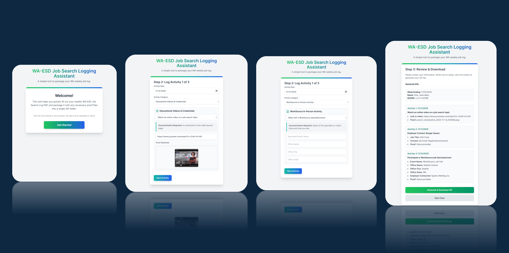

# WA-ESD Job Search Logging Assistant

A browser-based assistant wizard to help you document and package your weekly job search activities for the Washington State Employment Security Department (WA ESD).

A hosted version is available at: [https://tgjohnst.github.io/waesd-job-log-assistant/](https://tgjohnst.github.io/waesd-job-log-assistant/)

---

## Features

### 📝 Guided Job Log Entry
- **Step-by-step wizard**: Guides you through entering your weekly job search activities, ensuring you provide all required information for each activity.
- **Activity types**: Choose from a comprehensive list of job search activity categories recognized by WA
- **Activity summaries**: Review your entries before generating the final documents.
- **ZIP download**: Download a single ZIP file containing your filled PDF log and all proof files for the week.

### 📋 Activity Logging
- **Multiple activity types**: Supports a wide range of activity categories, including:
  - Employer contacts
  - WorkSource online and in-person activities
  - Hiring events, job fairs, clubs, etc.
  - Job search websites & assessments
  - Educational videos & credentials
  - Instructor-led and self-paced courses
  - App-based work (Uber, Lyft, etc.)
  - Private career coach/agency
  - WIOA programs and vocational rehabilitation
- **Dynamic forms**: Each activity type presents a tailored form with only the relevant fields.
- **Proof upload**: Easily upload screenshots, PDFs, or images as documentation for each activity.

### 📄 PDF Form Filling
- **Official WA ESD PDF**: Automatically fills out the official "ESD Job Search Log" PDF form using your provided information.
- **Accurate field mapping**: Handles the PDF's nonstandard field names and structure for reliable output.

### 📦 ZIP Packaging
- **All-in-one ZIP download**: Packages your filled PDF log and all proof files into a single ZIP file for easy upload or record-keeping.
- **Organized structure**: Proof files are placed in a dedicated folder within the ZIP.

### 🔒 100% Privacy
- **Runs entirely in your browser**: No data is ever uploaded or stored on any server.
- **No account or login required**: Just open the page and start logging.
- **Open source**: The complete source code is available for review and self-hosting if desired.
- **Runs offline**: Once loaded, the tool can function without an internet connection.

### 🖥️ User Experience
- **Modern, responsive UI**: Built with Tailwind CSS for a clean and accessible interface.
- **Error handling**: Friendly error messages and loading indicators guide you through the process.
- **"Set to This Week"**: Quickly set the week ending date to the upcoming Saturday.

---

## Usage

1. **Open `index.html` in your browser.**
2. Click **Get Started** and follow the wizard:
   - Enter your week ending date, name, and ID/SSN.
   - Log three job search activities, selecting the appropriate category and filling in the required details.
   - Upload or paste proof files as needed.
3. **Review** your entries on the summary screen.
4. Click **Generate & Download ZIP** to receive a ZIP file containing your filled PDF and all proof files.
5. Submit or save the ZIP as required by WA ESD.

---

## Requirements

- Modern web browser (Chrome, Firefox, Edge, Safari)
- No installation or server required

---

## Credits

- [pdf-lib](https://pdf-lib.js.org/) for PDF manipulation
- [JSZip](https://stuk.github.io/jszip/) for ZIP file creation
- [FileSaver.js](https://github.com/eligrey/FileSaver.js/) for file downloads
- [Tailwind CSS](https://tailwindcss.com/) for UI styling

---

## Disclaimer

This tool is not affiliated with or endorsed by the Washington State Employment Security Department. **Always verify your submission and final job log meets official requirements.** Authors are not responsible or liable for any issues arising from the use of this tool.

---